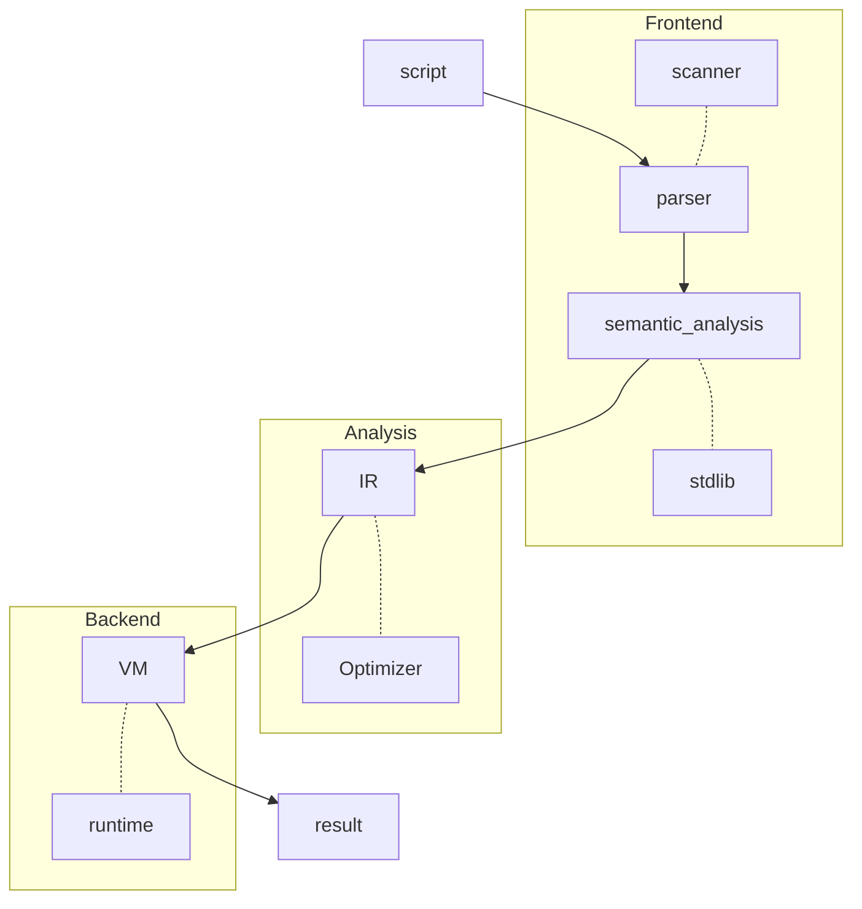

# Editions Proposal

This acts as the proposal to add the concept of editions to the flux language.

## Goals

The goal of editions is to offer a way to change the flux language in ways that may be breaking for existing scripts while retaining the stability of major versions.

During the development of a language, we will sometimes introduce syntax or library calls that seem to be correct, but turn out to become problematic when it is used in practice.
At the same time, stability is of paramount importance for a language.
A language that does not run the same script as it did yesterday is, for all intents and purposes, useless.

One way to deal with breaking language changes is to release a new version of the language and allow a developer to upgrade at their own leisure.
This is, unfortunately, still very heavyweight.
The cost to migrate from one version to the next is very difficult when you have to migrate all of your existing code.

Editions exist to allow the language to be stable while avoiding stagnation.

## Architecture of a Compiler

A compiler is typically split into the following sections:

We can see that the different components of the compiler are split into distinct sections.
The frontend covers user facing concerns.

Editions only affects the frontend section of the compiler.

## Mechanics

* Editions are per module, package, or file (we should choose)
* Editions are for breaking changes
* A migrator should exist for each new edition
* Past editions are maintained indefinitely
* Functions in experimental are not stable across or within an edition and may be removed
  * They do have a high probability of being promoted out of experimental in the next edition
  * A best effort at deprecating the function will be made to reduce breaking user code
* Additive changes may be made within an edition (such as new functions)
* Previous configurations of the standard library will be available at a specific import path

## First Edition

Steps to create first edition:

* Move functions that are not intended to be experimental out of experimental.
  * It's ok for some functions to be in experimental (they will be added in a future edition maybe).
* Define table find behavior.
  * Mark that the existing behavior is buggy and not part of the first edition.
